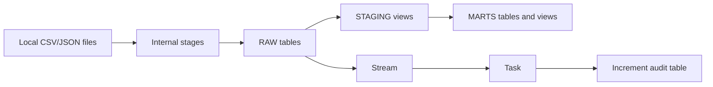

# Architecture Notes

## Simple Lab Architecture



## Why This Architecture Exists

This lab uses a small version of a common analytics engineering pattern:

- Raw keeps the loaded source data close to the original files.
- Staging cleans, casts, renames, deduplicates, and validates.
- Marts answer business questions with facts, dimensions, and KPI views.

This is enough structure to be realistic, but not so much that the project becomes a platform engineering exercise.

## Object Definitions

Role:

A role is a permission bundle. In this lab, `RETAIL_LAB_DEVELOPER` owns or uses the lab objects so you do not work as `ACCOUNTADMIN` all day.

Warehouse:

A warehouse is compute. It runs SQL, loads files, builds tables, and executes tasks. The lab warehouse is `XSMALL`, has `AUTO_SUSPEND = 60`, and can auto-resume.

Database:

A database is the top-level container for the lab. Here it is `RETAIL_LAB_DB`.

Schema:

A schema groups objects by purpose. This lab uses `RAW`, `STAGING`, `MARTS`, and `UTIL`.

Table:

A table stores rows. Raw and mart objects are tables where persistence is useful.

View:

A view stores a SQL definition. Staging models are views to keep the lab light and easy to iterate.

File format:

A file format stores parsing rules. `UTIL.CSV_STANDARD` tells Snowflake about headers, quotes, spaces, and nulls.

Stage:

A stage stores files before loading. `RAW.CSV_STAGE` and `RAW.JSON_STAGE` are internal Snowflake stages.

Stream:

A stream tracks table changes since the last time the stream was consumed by DML.

Task:

A task runs SQL on a schedule or through manual execution. In this lab, the task consumes stream rows into an audit table.

## Data Model

Dimensions:

- `MARTS.DIM_CUSTOMERS`
- `MARTS.DIM_PRODUCTS`

Facts:

- `MARTS.FACT_ORDERS`
- `MARTS.FACT_ORDER_ITEMS`

KPI views:

- `MARTS.V_REVENUE_BY_DAY`
- `MARTS.V_TOP_PRODUCTS_BY_REVENUE`
- `MARTS.V_CUSTOMER_SEGMENT_KPIS`
- `MARTS.V_AVERAGE_ORDER_VALUE`
- `MARTS.V_CUSTOMER_BEHAVIOR_ENRICHED`
- `MARTS.V_ORDER_DATA_QUALITY_ISSUES`

## Why JSON Events Matter

The `events.json` file simulates clickstream behavior. It is not perfectly relational: it has nested fields like `context` and arrays like `items`.

Snowflake's `VARIANT` type lets you load this data before deciding exactly which fields matter. `FLATTEN` is then used when an array needs to become rows.

## Cost Notes

The dataset is intentionally tiny. The main cost risk is not data volume, it is leaving compute running.

Use:

```sql
ALTER WAREHOUSE RETAIL_LAB_WH SUSPEND;
ALTER TASK UTIL.LOAD_NEW_ORDERS_AUDIT_TASK SUSPEND;
```

when you pause or finish the lab.

